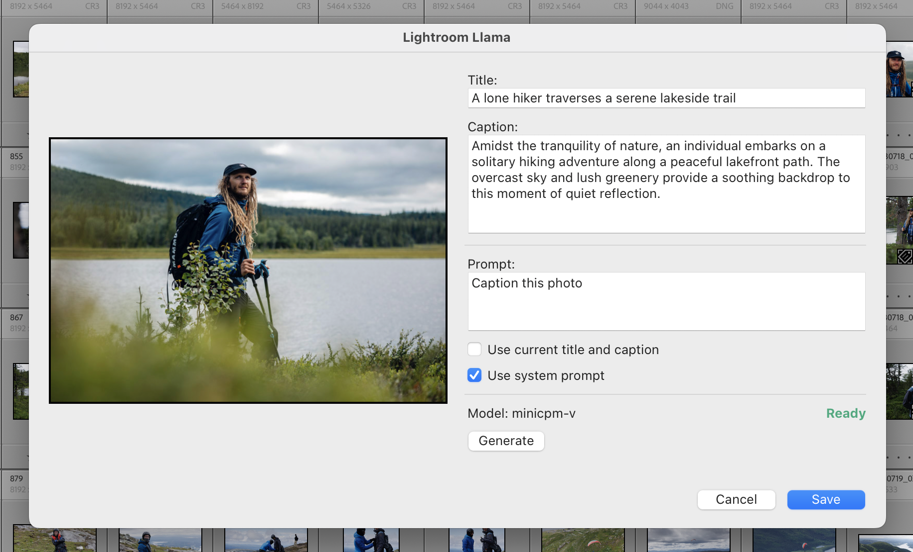

<h1 align="center">
  
   
  Lightroom Llama
</h1>

<h4 align="center">Generate metadata for your photos with ollama, directly in Lightroom</h4>

  <a href="#key-features">Key Features</a> •
  <a href="#how-to-use">How To Use</a> •
  <a href="#credits">Credits</a> •
  <a href="#related">Related</a> •
  <a href="#license">License</a>

## Key Features

- Generate metadata for your photos with ollama, directly in Lightroom
- Great for generating titles and captions for your stock photos
- Local generation, no internet required and your photos aren't uploaded anywhere

## How To Use

### Installation

1. Clone or download the latest version of Lightroom Llama from [here](https://github.com/thejoltjoker/lightroom-llama).
2. Open Adobe Lightroom Classic
3. Go to File > Plug-in Manager
4. Click the "Add" button in the bottom left
5. Navigate to the downloaded plugin folder and select the `.lrplugin` file
6. Click "Done" to close the Plug-in Manager

### Prerequisites

- Adobe Lightroom Classic
- [Ollama](https://ollama.ai/) installed and running on your computer
- An LLM model downloaded in Ollama (e.g., Llama 2)

### Ollama setup
1. Open a terminal
2. Install [Homebrew](https://brew.sh/) if you don't have it already
   1. `/bin/bash -c "$(curl -fsSL https://raw.githubusercontent.com/Homebrew/install/HEAD/install.sh)"`
3. `brew install ollama`
4. `ollama run minicpm-v`

For latest instructions on how to install and run Ollama, see [here](https://github.com/ollama/ollama).

## TODO

- [ ] Add support for more LLM models
- [ ] Implement batch processing for multiple photos
- [ ] Add customizable prompt templates
- [ ] Create settings panel for model configuration
- [ ] Improve error handling and user feedback

## Credits

- [Ollama](https://ollama.com/).

## Related

- [ChatGPT for Maya](https://github.com/thejoltjoker/chatgpt-for-maya) - Autodesk Maya plugin for context aware chatting with ChatGPT. Get tips, automate tasks and run code.

## You may also like...

- [Lightroom Power Collection](https://github.com/thejoltjoker/lightroom-power-collection) - Lightroom plugin to create a smart collection to semi-automate publishing.

- [Lightroom Workflow](https://github.com/thejoltjoker/lightroom-workflow) - My Lightroom workflow and presets that I have created and use for editing, organizing and exporting my photos.

## License

This project is licensed under the [MIT License](LICENSE).

